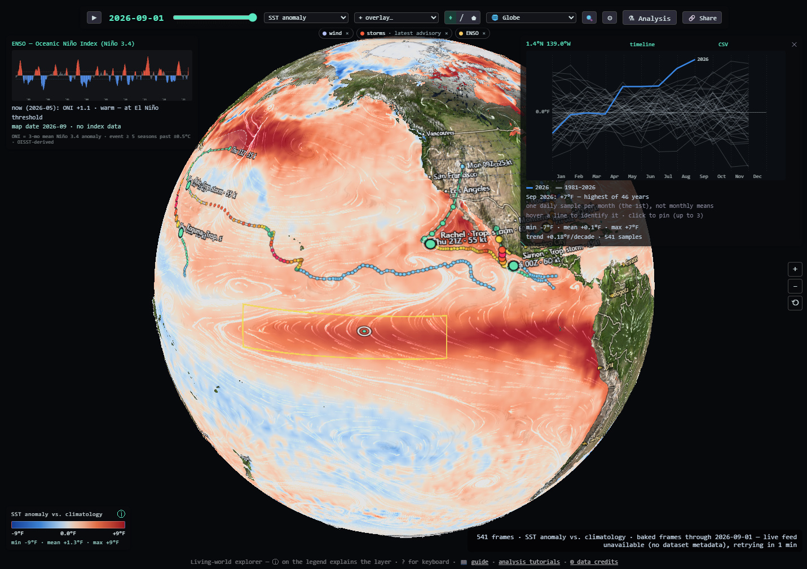

# Earth Explorer

A living-world map of ocean, atmosphere and climate data, rendered with WebGPU in the browser.

[Run Earth Explorer](https://brendan-duncan.github.io/earth_explorer/)

Sea-surface temperature and anomaly, sea ice, chlorophyll, coral heat stress, waves, GFS weather,
rainfall, satellite true color and GOES imagery, drawn on a flat map (equirect, Mercator,
Mollweide, Equal Earth, polar) or a relief globe. Overlays add currents and wind particle trails,
weather radar, tropical cyclones, wildfires, boundaries and places. A built-in analysis language
(with an optional Claude/Gemini "Ask" tab and an on-device forecast model) runs correlations, 
composites and time series over the data stacks.



## Docs

- [Deep-dive](docs/deep-dive.md): how the app works, from the data feeds to the display shader.
- [Analysis reference](docs/analysis.md): the analysis language's value types and every node.
- [Analysis tutorials](docs/tutorials/README.md): five guided lessons in the graph editor.
- [Design notes](docs/design/): background on the analysis graph and the forecaster.

## Requirements

A browser with WebGPU (Chrome/Edge 113+, Safari 26+, Firefox 141+ on Windows).

## Develop

```sh
npm install
npm run dev        # http://localhost:5173/
npm test           # vitest unit tests
npm run build      # type-check + production build → dist/
```

## Deploy

Pushing a version tag (`git tag v0.1.0 && git push origin v0.1.0`) builds and publishes to GitHub
Pages via [.github/workflows/pages.yml](.github/workflows/pages.yml). The build uses relative paths, so it
also runs from any subdirectory of another static host: copy `dist/` there.

## Layout

Live feeds are fetched browser-direct from CORS-open hosts (NOAA ERDDAP, NASA GIBS, NOAA STAR,
RainViewer, OBIS, …). Datasets whose hosts send no CORS header are baked ahead of time into
`assets/geo/` by the scripts in `tools/geo/`.

- `src/main.ts` — the app: one fullscreen WebGPU pass, UI, input, layer management.
- `src/live/` — data feeds (OISST, GIBS, GOES, RainViewer, cyclones, wildfires, …).
- `src/analysis/` — the analysis language (AST, interpreter, ops, presets, worker).
- `src/ui/` — panels: analysis, chat providers, forecast, layer info, import, reproduce.
- `src/geo/` — GeoJSON and MVT decoding, Web Mercator imagery providers.
- `src/gpu/` — WebGPU device/canvas context and texture helpers.
- `assets/geo/` — baked data stacks, basemaps and the forecast model.
- `tools/geo/` — Node bake scripts for `assets/geo/`, and the forecast training script.

## Data credits

See the "© data credits" popover in the app footer. Basemaps © Solar System Scope (CC BY 4.0).
