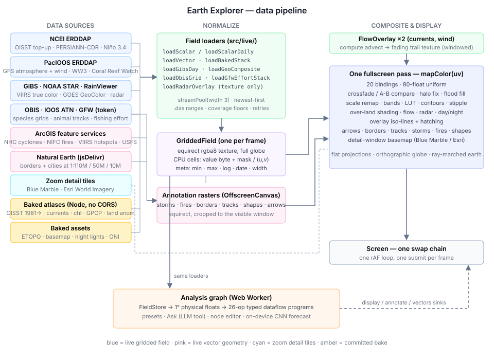
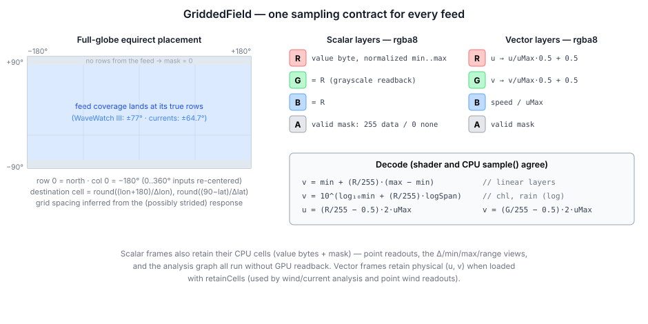
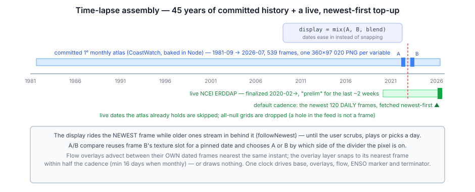
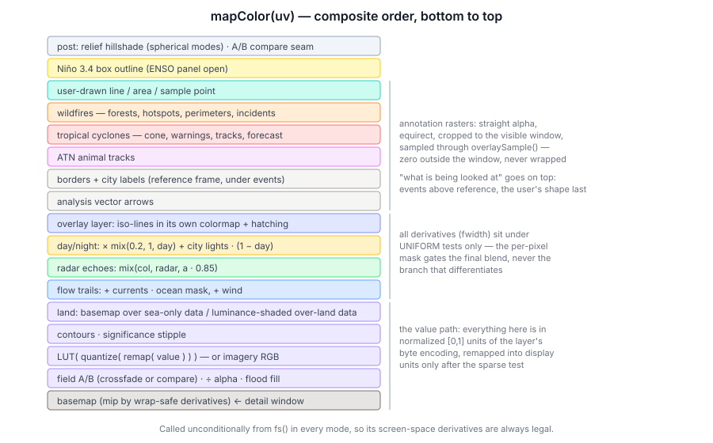
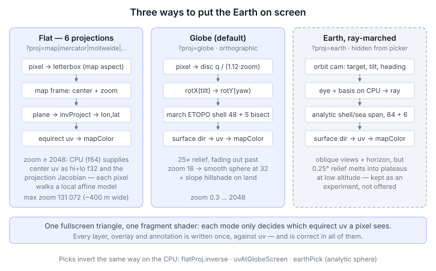
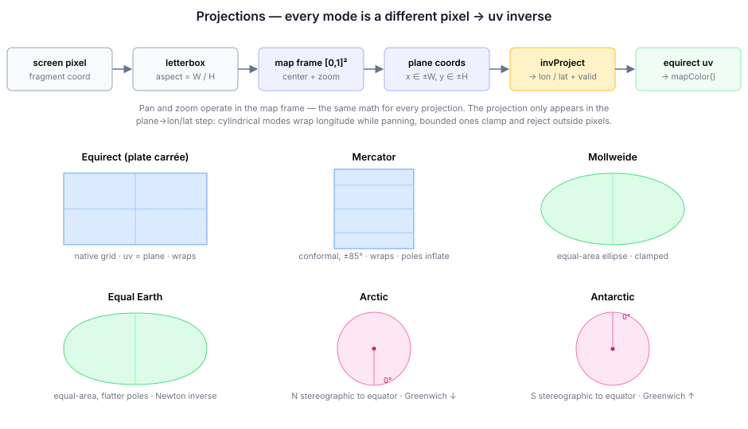
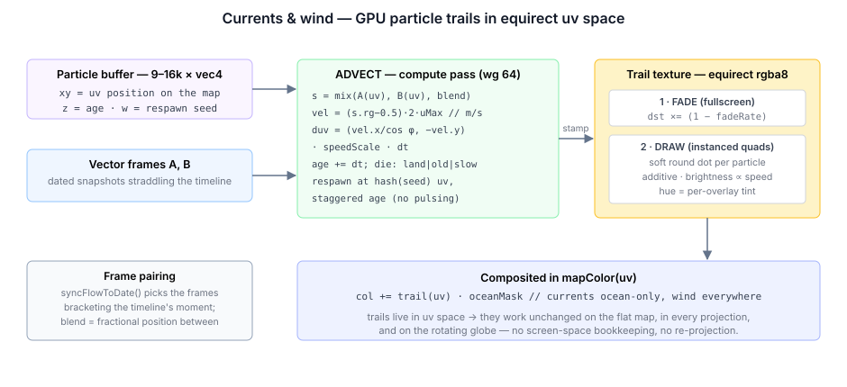

# Earth Explorer — a Living Map of the Earth's Oceans and Weather

[Run Earth Explorer](https://brendan-duncan.github.io/earth_explorer/) · [`src/main.ts`](../src/main.ts)

A world map that is *alive*. It shows sea-surface temperature, anomaly and ice back to 1981; waves, swell and wind-sea; coral heat stress and marine heatwaves; rainfall, air, skin and humidity fields; the surface radiation budget; species occurrences, tagged-animal tracks and fishing effort; true-color and geostationary imagery; radar, cyclones, wildfires, borders and cities. The data comes from real NOAA, NASA and partner feeds, streamed straight into the browser and played as a time-lapse.

You can view it in six flat projections or on a ray-marched relief globe. The map also answers questions about its data: click a point, draw a line or an area, compare two dates under one color scale, export any readout as CSV with a provenance header, or run a typed **analysis program** — written by hand, picked from a preset, or authored by an LLM from a plain-English question.

This document is the technical deep dive. It covers where each byte comes from, what happens to it, how it reaches the screen, and why each piece is shaped the way it is. The analysis engine has its own [module reference](./analysis.md) and [tutorial series](./tutorials/README.md), so here it appears only where it touches the explorer.



The app is one ~7,500-line TypeScript file plus a handful of helpers:

| File | Role |
| --- | --- |
| [`src/main.ts`](../src/main.ts) | Layer table, loaders' orchestration, the WGSL display shader, every view mode, input, UI |
| [`src/flow_overlay.ts`](../src/flow_overlay.ts) | GPU particle trails for currents and wind |
| [`src/projections.ts`](../src/projections.ts) | CPU twins of the WGSL projections |
| [`src/ui/layer_info.ts`](../src/ui/layer_info.ts) | The ⓘ explanations and citations for every layer |
| [`src/ui/reproduce_panel.ts`](../src/ui/reproduce_panel.ts) | "Get this data": the exact request, xarray/R snippets, citation |
| [`src/ui/import_panel.ts`](../src/ui/import_panel.ts) | "Your data": GeoJSON study areas and station-CSV match-ups |
| [`src/ui/analysis_panel.ts`](../src/ui/analysis_panel.ts) | Presets / Ask / Graph front ends to the analysis engine |
| [`src/live/`](../src/live/) | One loader per feed, plus `GriddedField`, ENSO, sun, match-up and request-reproduction logic |
| [`tools/geo/`](../tools/geo/) | Node bake scripts for everything the browser cannot fetch itself |

---

## 1. The load-bearing decision: one sampling contract

Every field-shaped thing the explorer shows is normalized into one shape: an **equirectangular texture on a full −180..180° / +90..−90° grid**, wrapped in [`GriddedField`](../src/live/gridded_field.ts). Row 0 is north, column 0 is 180°W. That covers two dozen value layers, two particle overlays, radar, imagery, relief and city lights. Every downstream system is written once against that contract:

- One fullscreen fragment pass (`mapColor(uv)`) composites the entire display.
- Flat projections, the globe and the ray-marched earth differ only in how they produce a `uv` per pixel (§6).
- Particle overlays advect in uv space, so their trails work in every projection and on the globe with no re-projection (§8).
- Vector annotations (storms, fires, borders, drawn shapes) are rasterized into equirect textures and composited by uv (§9).
- The analysis engine and every readout consume the CPU copy of the same cells (§10, §13).



### 1.1 Full-globe placement

ERDDAP answers a griddap `.json` request with a table of `(time, [zlev,] lat, lon, value)` rows. Feeds disagree on longitude convention (0..360 vs ±180), latitude order and coverage band. WaveWatch III stops at about ±77°, and the baked currents stop at ±64.7°. `buildGrid` infers the grid spacing from the unique sorted lats and lons in the (possibly strided) response, sizes a full-globe raster from it (`width = round(360/dLon)`, `height = round(180/dLat)`), and drops every row at its true position. A partial feed lands where it belongs, and everything it did not cover stays `mask = 0`:

```ts
// gridded_field.ts — place one response row into the full-globe raster
const lon = raw >= 180 ? raw - 360 : raw;                                      // 0..360 → ±180
const lat = flipLat ? -r[iLat] : r[iLat];                                      // GFS archive fix, §2.4
const col = ((Math.round(((lon + 180) / 360) * width) % width) + width) % width;
const row = Math.min(height - 1, Math.max(0, Math.round(((90 - lat) / 180) * (height - 1))));
```

### 1.2 Encoding

**Scalar** layers store one normalized byte per cell in `R` (duplicated into G and B), with the valid mask in `A`:

- Linear layers encode `byte = round(255·(v − min)/(max − min))`.
- Log layers (chlorophyll, rainfall, species counts, fishing hours) encode the same fraction of `log10`.
- The physical range and log flag live in `meta`.

One decode function serves the shader and the CPU `sample()` alike:

```ts
decode(byte: number): number {
  const n = byte / 255;
  if (this.meta.isLog) {
    const l0 = Math.log10(this.meta.min);
    return Math.pow(10, l0 + n * (Math.log10(this.meta.max) - l0));
  }
  return this.meta.min + n * (this.meta.max - this.meta.min);
}
```

**Vector** layers (currents, wind) encode `R = u/uMax·0.5+0.5`, `G` the same for v, and `B = speed/uMax`. The B channel exists purely so the flow overlay can read speed with one fetch.

**Derived** fields (analysis results) are built by `GriddedField.fromBytes`. It accepts an optional per-cell flag and puts it in **B**, the one channel no value path samples. The flag means "this cell's estimate failed its significance test", and the shader draws a stipple over those cells (§5.5). The flag is zeroed outside the mask. That way, a bilinear fetch divided by alpha gives the fraction of flagged *valid* neighbors rather than bleeding across a no-data edge.

Scalar frames **retain their CPU cells** (`values` bytes plus `mask`). That is what powers hover values, point time series, transects, area means, the Δ/mean/min/max/range views, auto-fit scales, station match-ups and the whole analysis graph, all without a single GPU readback. Vector frames retain physical `(u, v)` floats when loaded with `retainCells`. `stats()` computes byte-level min/mean/max over valid cells once and caches it. An all-null grid returns NaN, and the explorer uses that to reject empty frames (§3.2).

### 1.3 Keyless and browser-direct where possible

The NCEI and PacIOOS ERDDAP servers, NASA GIBS, NOAA STAR, RainViewer, OBIS, IOOS ERDDAP, the ArcGIS feature services and jsDelivr all send CORS headers. So nearly the whole app runs with **zero configuration and no server of its own**. One source needs credentials, and it ships with a working built-in default: **Global Fishing Watch** needs a token. A deliberately public one is compiled in, and `localStorage.earth_explorer_gfw_token` overrides it.

Feeds whose hosts send no CORS header at all are **baked offline** by Node scripts in [`tools/geo/`](../tools/geo/) into committed PNG atlases:

- CoastWatch's OISST, currents and chlorophyll.
- NOAA PSL's GPCP and GHCN-CAMS.
- ETOPO relief.
- The ONI history.

---

## 2. The layers and their feeds

### 2.1 The `LAYERS` table

Every base layer is one `BaseLayer` record, and the whole UI — the grouped picker, the overlay picker, the legend, the ⓘ panel, the analysis catalog — is derived from that table. The fields that change behavior:

| Field | Meaning |
| --- | --- |
| `kind` | `oisst` / `live` (ERDDAP stack), `baked` (atlas only), `imagery` (GIBS RGB), `geo-live` (GOES composite), `obis`, `gfw` |
| `source` | a `ScalarSource`: servers, datasets (tried in order), variable, `hasLevel`, range, `isLog`, `strideScale` |
| `bakedStack` | committed atlas prepended to the live stack |
| `overLand` | the quantity exists over land (GFS, GPCP, land anomaly): draw data over the basemap |
| `sparse` | the scale floor means "nothing here" (rain, heat stress, counts): render it as background, and don't flood-fill holes |
| `deltaRange` | ± full-scale of the Δ view, in physical units |
| `overlayBands`, `overlayHatchAt` | how the layer draws when it is the *overlay* (§5.6) |
| `fmt` / `fmtRel` / `fmtSpan` | absolute, relative (signed, no °F offset), and span formatters |

A parallel `ANALYSIS_META` record gives each layer:

- its analysis **unit**, plus any conversion (K → °C, Pa → hPa, fraction → %, kg m⁻² s⁻¹ → mm/h);
- whether it is a **relative** quantity;
- a **coverage floor** (`start`, YYYY-MM);
- **caveats**.

The coverage floor is authoritative, and it exists because feeds advertise more time than they serve. PacIOOS's GFS aggregation claims 2022-12 onward, but its four radiation fluxes return all-null grids before about 2026-01. Clamping to the floor keeps the timeline, the calendar and the analysis store from offering empty months.

| Group | Layers | Source | Path into the browser |
| --- | --- | --- | --- |
| Ocean | SST, SST anomaly, sea ice | NOAA OISST v2.1 | 1° atlas 1981-09 → bake date, plus live NCEI ERDDAP top-up (native 0.25°) |
| Ocean | Chlorophyll-a | S-NPP VIIRS monthly (CoastWatch) | baked atlas, log10 over 0.02–20 mg/m³ |
| Coral & heat stress | Degree heating weeks, bleaching alert, marine-heatwave category | NOAA Coral Reef Watch 5 km | live PacIOOS ERDDAP, decimated ×10 (`strideScale`) |
| Waves | Total height, swell, wind-sea, peak period | NOAA WaveWatch III | live PacIOOS ERDDAP (2017-02 →) |
| Atmosphere | Rainfall rate, 2 m air temp, skin temp, humidity, sea-level pressure, 4 radiation fluxes | NOAA GFS | live PacIOOS ERDDAP (2022-12 →, +7-day forecast edge) |
| Atmosphere | Daily rainfall 1983 → | NOAA PERSIANN-CDR | live NCEI ERDDAP, ±60° |
| Atmosphere | Monthly rainfall 1979 → | GPCP v2.3 | baked atlas at native 2.5° |
| Atmosphere | Land temperature anomaly 1979 → | GHCN-CAMS | baked atlas, anomaly vs 1991–2020 |
| Life | Species occurrences | OBIS | live gridded endpoint (counts per cell) |
| Human activity | Apparent fishing effort | Global Fishing Watch | live vector tiles, one year → 12 monthly frames |
| Imagery | Satellite true color | NASA GIBS VIIRS | live 4326 WMTS tiles, 2012-01-19 → |
| Imagery | GOES live clouds | NOAA STAR GeoColor | live full disks, reprojected on the CPU |

The overlays and reference geometry that are *not* layers:

| Overlay | Source | Path |
| --- | --- | --- |
| Surface currents (flow) | NOAA CoastWatch geostrophic (`miamicurrents`) | baked vector atlas, 2016-09 → |
| 10 m wind (flow) | NOAA GFS | live PacIOOS vector stack |
| Weather radar | RainViewer | live Mercator tiles, reprojected |
| Animal tracks | US IOOS Animal Telemetry Network | live IOOS ERDDAP tabledap, QARTOD-passed fixes |
| Tropical cyclones | NOAA/NWS NHC advisory feature service | live GeoJSON, six layers |
| Wildfires | NIFC/WFIGS + VIIRS hotspots + USFS forests | live GeoJSON, viewport-scoped |
| Borders, cities | Natural Earth | static GeoJSON via jsDelivr, three scales |
| Zoom detail | GIBS Blue Marble, Esri World Imagery | tile windows (§7) |
| Relief, basemap, land mask, night lights, ONI | ETOPO1, Solar System Scope, OISST | baked assets |

### 2.2 ERDDAP mechanics

Every live gridded request has the same shape. `GriddedField.loadScalar` issues:

```ts
const q = `${src.variable}[${timeSel}]${src.hasLevel ? '[0]' : ''}[0:${stride}:last][0:${stride}:last]`;
// → `${server}/${dataset}.json?` + q, with only [ and ] percent-encoded
```

Details that matter:

- **Fallback order.** Servers form the outer loop and datasets the inner one; the first HTTP-ok answer wins.
- **Routing by date.** `sourceTimeRange` reads each dataset's `.das` once and records its `time actual_range` in `DATASET_RANGES`. `routeByDate` then reorders a source's datasets so the one that covers the requested date is asked first. OISST splits its record across a *finalized* dataset (2020 → about two weeks ago) and a *prelim* one (the newest days), and without routing every historical fetch paid a 404 before falling back.
- **Caching.** Dated requests use `cache: 'force-cache'`, because an archived day never changes. `(last)` uses `'default'`.
- **Nearest-index snapping.** ERDDAP's `(time)` selector snaps to the nearest index. A request past a feed's coverage silently returns an edge frame rather than failing. Loaders therefore dedupe by the returned date, and the analysis providers drop out-of-range frames.
- **Resolution.** The explorer's `stride` is 1 (native, the default), 2 or 4. `strideFor(src, stride) = max(1, round(stride · strideScale))` scales it per feed, so every live layer lands on a comparable cell count. Coral Reef Watch is 0.05° native (7200×3600, about 14 MB of JSON per frame), so its `strideScale = 10` puts it on a ~0.5° grid. PERSIANN uses 2.
- **Cost.** One OISST day is about 282 KB at 1°, 1.1 MB at 0.5° and 4.4 MB at native 0.25°. The defaults — native grid, daily cadence — are deliberately the full-fidelity view. This is a data explorer, and a coarse default quietly answers questions with less than the data has. Both settings are in the gear menu.

### 2.3 OISST — the backbone (sst · anom · ice)

The NCEI ERDDAP serves 0.25° daily OISST with CORS, but its aggregation only reaches back to 2020-02-28, and NCEI has dropped these datasets outright before (mid-2026). So the full record is committed:

- [`bake_oisst_stack.mjs`](../tools/geo/bake_oisst_stack.mjs) pulls CoastWatch's full `ncdcOisst21Agg_LonPM180` aggregation in Node.
- One request per date fetches all three variables at stride 4 (1°).
- It writes three atlases of **539 monthly frames** each, 1981-09-01 → 2026-07-01, about 50 MB total. At 0.5° the anomaly atlas alone would be 87 MB, and the analysis ops and the forecaster work at 1° anyway.
- Fixed ranges: sst −2..34 °C, anom −5..5 °C, ice 0..1.

The live stream then only *tops up* dates newer than the bake. `SINCE_YEAR = 1981` is the timeline start, because forty-five years is what makes a trend or a 30-year climatology mean anything — a decade of it is weather.



**Atlas layout.** A baked stack is one tall PNG per variable, with frame *i* in rows `[i·H, (i+1)·H)`. A JSON sidecar carries `{min, max, log?, uMax?, width, height, frames, dates[]}`. `loadBakedStack` decodes it like this:

- It creates the image with `createImageBitmap(blob, {colorSpaceConversion: 'none'})`.
- It copies each kept frame into its own GPU texture with `copyExternalImageToTexture` at `origin.y = i·H`.
- It reads the CPU bytes back through an OffscreenCanvas.

The readback has a trap. The 1° OISST atlas is **360 × 97,020 px**, and a canvas past the browser's size limit does not throw — it reads back all zeros, which marks every cell invalid. So the CPU decode runs in slabs of `floor(16384 / H)` frames.

Atlases are baked monthly. The display cadence (4, 2 or 1 months) filters frames at load with `everyMonths`, keeping frame *i* when `(monthOrd(date_i) − monthOrd(date_0)) % every == 0`.

**Fast first paint.** Before any stack arrives, a baked single-day SST snapshot (`sst_oisst.png`, 720×360) is loaded as `bootField`. It claims the screen only if SST is still the active layer and nothing else has landed. A `?layer=` deeplink races that fetch, and the snapshot must not squat on another layer's colormap.

### 2.4 GFS atmosphere — the latitude-flip probe and the sampling hour

The PacIOOS ERDDAP aggregates NOAA GFS (`ncep_global`):

- rainfall rate;
- 2 m air temperature, skin temperature and humidity;
- sea-level pressure;
- four surface radiation fluxes;
- the 10 m wind vector.

The archive floor is about 2022-12, and the range's end is the **+7-day forecast edge**, so the calendar can pick a date a week in the future.

**The flip probe.** One upstream bug was found by staring at a Tibet warmer than the ocean: **archived dates serve latitude-flipped grids**, while current dates are labeled correctly. Before loading any GFS date, the explorer fetches two cells and asks a question whose answer does not depend on the season:

```ts
// The Tibetan plateau (30N/88E, ~4.7 km up) is colder than the subtropical ocean at its mirror
// point in EVERY season — if the cold end carries the −30 label, the grid is flipped.
const q = `tmp2m[(${timeISO})][(-30.0):120:(30.0)][(88.0)]`;
...
flipped = north - south > 2;   // Tibet must be the cold end (K)
```

The answer is cached per timestamp in `gfsFlipCache` and passed to the loader as `flipLat`. WaveWatch on the same server probes clean.

**The sampling hour.** GFS is 3-hourly, and the explorer's frames are daily, so it has to choose which instant represents a day. The default `snapshot` is 12:00 UTC, which is 06:00 in New Mexico, 13:00 in Nigeria and 21:00 in Japan. For diurnal fields that spread is larger than the geography: one high-desert cell reads 14 °C at 12 UTC and 46 °C six hours later.

The gear menu's **daily max / min / mean** switches to `GriddedField.loadScalarDaily`:

- It makes one range request per day, `(${date}T00:00:00Z):1:(${date}T21:00:00Z)`, which covers eight 3-hourly steps and costs about 8× the payload.
- It reduces per cell on the CPU with a `Float64Array` accumulator and a `Uint16Array` count.
- The result is coherent worldwide, because every longitude passes local noon exactly once inside a UTC day.

This reduction is **display-only**. The analysis graph keeps reading the literal 12:00 UTC frame, because it has explicit `timeReduce` ops and a hidden reduction under an op called `layer` would be a trap. The legend title carries ` · daily max` so a screenshot says which one it is.

Because GFS layers cover land, they are `overLand` and draw over the basemap (§5.4). Rain is `sparse`, so values at the scale floor render as background instead of smearing the colormap's bottom color across the planet.

### 2.5 Coral Reef Watch, WaveWatch, PERSIANN

- **Coral Reef Watch** (`dhw_5km` for degree heating weeks and bleaching alert level, `mhw_5km` for marine-heatwave category):
  - The 1985 record start predates every other live feed. The explorer floors it at 2016, and the heatwave product at 2024-07.
  - All three are ocean-only and `sparse`. Their floor means "no stress", and CRW masks every sea-ice cell, so the coastal flood fill (§5.3) is disabled for them. An 8-direction search across a genuine hole would invent star-shaped spikes of heat stress.
- **WaveWatch III** (`ww3_global`): total significant height and period (`Thgt`, `Tper`) plus the swell (`shgt`) and wind-sea (`whgt`) split. There is no coverage poleward of ±77°; that band stays masked and renders as a deep "no coverage" tone.
- **PERSIANN-CDR** on NCEI: satellite daily rainfall totals back to 1983. It is the only precipitation record whose daily data spans decades, though only ±60°.

### 2.6 The long monthly climate records

Daily PERSIANN is far too heavy to average over decades in a browser, and GFS starts in 2022. ENSO work — regressing rainfall or temperature on the Niño index over ~45 winters — needs long *monthly* records. [`bake_climate_stacks.mjs`](../tools/geo/bake_climate_stacks.mjs) reads NOAA PSL THREDDS OPeNDAP in Node, parsing the binary `.dods` response directly (big-endian XDR float32; ASCII would be ~10× the bytes):

- **GPCP v2.3** precipitation, 1979-01 →, 570 frames. It stays on its **native 2.5°** grid (144×72), only reordered north-first and rotated to start at −180°. It is encoded **log10** over 0.05–40 mm/day, because a linear 8-bit ramp flattens every desert to zero.
- **GHCN-CAMS** land 2 m temperature, 1979-01 →, 572 frames:
  - Block-averaged 0.5° → 1°.
  - Converted to an **anomaly** against a per-cell, per-calendar-month 1991–2020 climatology; a cell needs ≥ 24 of 30 baseline years.
  - Encoded linearly over ±10 °C, about 0.08 °C per step.
  - An absolute 8-bit ramp over −50..40 °C would be 0.35 °C per step — the size of the ENSO signal itself.

The layer's caveat notes that the SST anomaly uses a 1971–2000 baseline, so the two anomaly layers are offset by recent warming.

### 2.7 Currents and chlorophyll

- [`bake_currents.mjs`](../tools/geo/bake_currents.mjs) samples CoastWatch's `miamicurrents` geostrophic analysis (0.2°, ±64.7°) at stride 4:
  - 0.8° grid, 450×225.
  - 30 frames every 4 months from 2016-09.
  - Vector encoding with `uMax = 2.5 m/s`.
- `bake_chlorophyll.mjs` samples the S-NPP VIIRS science-quality monthly product at stride 16:
  - 0.6° grid, 600×300.
  - 32 frames from 2016.
  - log10 over 0.02–20 mg/m³.
  - Two passes fill small holes with the mean of ≥ 3 valid neighbors; large cloud decks and polar night stay masked.
  - It sends a custom User-Agent, because CoastWatch's firewall 403s Node's default one on that dataset.

### 2.8 Life: OBIS and ATN

**OBIS** species occurrences are one layer with the species as a *parameter* rather than twelve near-identical layers, so one info entry and one citation cover every species. `loadObisGrid` calls `api.obis.org/v3/occurrence/grid/{precision}?scientificname=…`:

- Precision 3 (about 1.4°) is the default; `?obisgrid=1..4` changes it.
- The response is a GeoJSON cell grid carrying record counts.
- Each cell's lon/lat box is painted into a 1440×720 raster on a log scale (1 → the largest count).
- The picker offers twelve species — whales, sharks, commercial fish, loggerhead turtles — but any name OBIS indexes works via `?species=`.

The ⓘ text is blunt that occurrence counts measure *sampling effort* as much as abundance.

**ATN tracks** (`loadAtnTracks`) read IOOS ERDDAP's `atn_cacheFromUrl_collection` tabledap as CSV, filtered server-side to `qartod_rollup_flag=1` (QC-passed). Fixes are grouped by deployment and sorted by time. A track is split wherever consecutive fixes are more than 30 days apart or imply more than 12 km/h (a bad fix, not a fast animal), and runs shorter than 4 points are dropped. Each deployment gets its own hue (`i·47 mod 360`), a white dot marks where it started, and the result is rasterized into the annotation window (§9).

### 2.9 Human activity: Global Fishing Watch

Apparent fishing effort comes from GFW's 4Wings heatmap API as **Mapbox Vector Tiles**. `loadGfwEffortStack(year, zoom 2)` works like this:

- It fetches all 16 tiles at z2 with `interval=MONTH` and decodes them with the repo's own MVT decoder.
- Each feature's numeric properties are **month buckets** (`bucket = year·12 + month−1`), so one request per tile carries all twelve months. A scrubbable year costs exactly what one annual snapshot would.
- Features are painted into a 1440×720 raster per month. Overlaps keep the **max, not the sum**, because one Mercator cell covers many raster cells and summing would multiply its hours by its footprint.
- All months share one log scale (1 h → peak).
- Stacks are cached forever in the loader. The explorer marks those frames `shared: true` so a layer switch never destroys textures the cache still hands out (the analysis store's `sharedFrames` is the same contract).
- The year defaults to the last complete one; `?year=` overrides it.

### 2.10 Imagery: GIBS, GOES, radar

**GIBS** serves pre-rendered EPSG:4326 WMTS tiles, so a global true-color day is "just" a mosaic. The catch is that the 4326 TileMatrixSet is **not a power-of-two pyramid**:

- Level 0 is 0.5625°/px, so a 512-px tile spans 288°, and the world occupies only the top-left of the tile grid.
- At level *L* the world is `640·2^L × 320·2^L` px. `loadGibsDay` uses level 2 (2560×1280 from 15 tiles), fetches the ceiling number of tiles into an OffscreenCanvas, and crops to exactly 360°×180°.
- Failed tiles leave alpha-0 holes, which the shader fills with a dimmed basemap.
- Imagery frames are RGB as rendered by NASA, not value fields: the imagery flag (`u.p0.w`) bypasses the colormap, and imagery has no CPU cells, so no views, readouts or analysis.
- VIIRS lags about a day, so the newest frame and the calendar's max are the day before yesterday.

**GOES GeoColor** is harder. NOAA STAR publishes each satellite's full disk (GOES-19 East at 75.2°W, GOES-18 West at 137.0°W) as a 1808² JPEG in the ABI *fixed grid* — a perspective "geos" projection of scan angles. `loadGeoComposite` walks every pixel of a 2048×1024 equirect target (about 2M pixels, CPU, one-off per load) and does the following:

- Orders the satellites nearest sub-longitude first, once per column.
- Inverse-projects the pixel into scan angles.
- Rejects anything beyond 97% of the disk radius (the smeared limb).
- Bilinearly samples the JPEG.

```ts
// geostationary.ts — geodetic lon/lat → GOES scan angles, GRS80 ellipsoid
const latC = Math.atan(((R_POL * R_POL) / (R_EQ * R_EQ)) * Math.tan(lat));   // geocentric latitude
const rc   = R_POL / Math.sqrt(1 - E2 * Math.cos(latC) * Math.cos(latC));
const sx = H_ORBIT - rc * Math.cos(latC) * Math.cos(dLon);
const sy = -rc * Math.cos(latC) * Math.sin(dLon);
const sz = rc * Math.sin(latC);
if (H_ORBIT * (H_ORBIT - sx) < sy*sy + ((R_EQ*R_EQ)/(R_POL*R_POL))*sz*sz) {
  return null;                       // beyond the limb — not visible
}
return { x: Math.asin(-sy / Math.hypot(sx, sy, sz)), y: Math.atan2(sz, sx) };
```

Coverage runs from about 155°E eastward to 15°E. The Asia/Indian Ocean gap stays alpha-0 and shows as dim basemap.

**RainViewer radar** is the latest past frame of a rolling global composite. `loadRadarOverlay` builds it in three steps:

1. Mosaics the 16 zoom-2 Web-Mercator tiles (1024²).
2. Reprojects to a 2048×1024 equirect texture on the CPU, one row at a time. It uses nearest-neighbor sampling, and rows beyond ±85° are skipped.
3. Hands back a plain texture (not a `GriddedField` — it is never analyzed).

The shader alpha-blends it over the data (`mix(col, radar.rgb, radar.a · 0.85)`). Coverage is land radar networks only.

### 2.11 Tropical cyclones: the one feed whose point is a forecast

Every other live source is a grid of numbers the shader colors. A hurricane is not that. What forecasters issue, and what people act on, is a handful of vector features:

- where the center has been;
- where it is projected to go;
- how wide the uncertainty is;
- which coastline is under a warning.

So [`cyclones.ts`](../src/live/cyclones.ts) returns paths and polygons, and the overlay rasterizes them into the windowed annotation canvas (§9).

Six queries go to NOAA's advisory feature service on ArcGIS: observed positions, observed track, forecast positions, forecast track, error cone, and watches/warnings. That service is keyless, CORS-open and republished from NHC's six-hourly shapefiles. NHC's own `CurrentStorms.json` sends no CORS header, and the wind-radii and swath layers are skipped because at this scale they turn the cone into mud.

- **Failure handling.** Each query is independent (`Promise.allSettled`), and a failure is swallowed: a storm with a track but no cone still draws, because a dead layer during a landfall must not blank the map. If *nothing* answers, the call throws, so "no layers responded" and "no active storms" never look the same.
- **Refresh.** Advisories come at most every three hours, so a re-toggle inside five minutes reuses the package. After that it refetches, because a stale package during a landfall is exactly the wrong thing to cache forever.
- **Draw order** follows the advisory graphic:
  1. The cone, **filled**, since the center is about equally likely to pass anywhere inside it and an outline gets misread as the edge of the storm.
  2. The coastal alerts, in NHC's own colors: hurricane warning red, watch pink, tropical-storm warning blue, watch yellow.
  3. The past track, with one dot per six-hourly fix colored by the Saffir-Simpson intensity *at that fix*. This turns the line into an intensity history, which shows whether the storm is winding up or falling apart as it arrives.
  4. The forecast line, **dashed** so it never reads as fact.
  5. Forecast points with `Sun 18Z · 95 kt` labels, spaced by *screen* distance (≥ 110 px) rather than by index, since how far apart twelve forecast hours land depends on zoom, not on the advisory.
  6. The current position, largest, with name, class and wind.

The overlay always shows the latest advisory and deliberately does *not* follow the time slider. The status strip summarizes each storm's class, wind, pressure, motion and advisory time.

### 2.12 Wildfires: three feeds, three questions

[`wildfire.ts`](../src/live/wildfire.ts) draws on three sources that are easy to mistake for one:

- **Perimeters** (NIFC/WFIGS) show where a fire has burned *as last mapped*. They are authoritative but hours to days stale, because someone has to fly or walk the edge. They are national in one small request.
- **Incident records** give what is known now: acreage, containment, cause, crew. Their reported `DiscoveryAcres` can be off by orders of magnitude, so an incident's acreage is taken from its mapped polygon, joined by IRWIN id, whenever one exists.
- **VIIRS thermal hotspots** show where satellites saw heat in the last 24 h. This is the only near-real-time signal, and the one that shows which *side* of a fire is running. The archive holds about 1.8M detections, about 200k per day. So the query is viewport-bounded, ordered by fire radiative power, and capped at 3,000: when the cap bites, what survives is the biggest heat.

USDA Forest Service national-forest boundaries go underneath as context. They are fetched only once the view is regional (`du < 0.35`), with `maxAllowableOffset` scaled to the view so the generalization happens upstream. The Santa Fe National Forest is 1.7M acres of very crinkly edge, and full fidelity costs megabytes to draw a two-pixel line.

Rasterization choices:

- **Forests:** a wash and a hairline, because they are the ground, not the subject.
- **Hotspots:** color by FRP. Age is shown as *fade*, not color, because color already means intensity and a stale detection should look like weaker evidence, not a cooler fire.
- **Perimeters:** filled and cased. Prescribed burns are blue.
- **Incidents:** drawn last, biggest first, with two acreage floors that widen with the window. At national scale, a dot needs 5,000 acres and a label 100,000. Without them a national view is 500 overlapping dots and a wall of names. Labels pass through a screen-space collision placer, so what survives a crowded view is what matters.

Pans refetch only the viewport-scoped pieces:

- The bbox key is rounded to 0.1°.
- A fetch in flight defers the next one via `firePending` rather than dropping it. That is the *normal* case at startup, where the deeplink kick runs against the world window and the real one arrives a moment later.
- Only a *successful* fetch claims the viewport, so a failure retries.

### 2.13 Reference geometry: a ladder, not a layer

Borders and city labels are **on by default**: reference geometry is the frame the rest of the map is read against, and a few hundred KB is a small price. `?borders=0` / `?cities=0` opt out. This is the one overlay whose *data* changes with zoom rather than just its rasterization. Natural Earth ships the same borders generalized by cartographers at 1:110M, 1:50M and 1:10M, and [`admin_places.ts`](../src/live/admin_places.ts) picks by zoom: `detailForZoom` returns `10m` at zoom ≥ 12, `50m` at ≥ 3, otherwise `110m`. Levels are cached forever, so only the first visit to a scale pays and zooming back out is a redraw. State lines at 10m fall back to the 50m file, because the 10m one exceeds jsDelivr's 20 MB limit.

International borders are cased and solid. State lines are thinner and dashed, and drawn first, so a state line never competes with a national border.

City labels are thinned by Natural Earth's own `scalerank`, its editorial judgment of which cities earn a label at which scale: `placeRankForZoom = clamp(round(log2(zoom)) + 1, 1, 10)`, one rank per doubling of zoom. Labels then pass the screen-space collision placer. Ranking by raw population instead would put every Chinese prefecture city on a world map and drop Reykjavík. Capitals get gold, and populations appear only once the view is regional.

### 2.14 The ONI record

The ENSO panel needs *monthly* resolution, denser than a coarse map cadence, so it has its own record:

- [`bake_enso.mjs`](../tools/geo/bake_enso.mjs) produces a 10 KB baked file of monthly Niño 3.4 box means, 1981-09 → (538 months). It samples every 4th cell and every 5th day of the CoastWatch OISST anomaly.
- `fetchNino34Live` extends it to today browser-direct from NCEI, fetching only that box.
- [`enso.ts`](../src/live/enso.ts) computes the ONI as the centered 3-month running mean (a month gap breaks the window) and classifies events by the CPC rule: ±0.5 °C for ≥ 5 consecutive overlapping seasons.
- Strength labels are weak, moderate (≥ 1.0), strong (≥ 1.5) and very strong (≥ 2.0).

It is OISST v2.1 against its 1971–2000 baseline, not the official ERSSTv5 ONI, and agrees with it to about 0.1 °C.

### 2.15 Static assets

- **Basemap**, [`bake_basemap.mjs`](../tools/geo/) from Solar System Scope 8k imagery (CC BY 4.0): day color 4096×2048 with a land mask in alpha; night lights 2048×1024.
- **Land mask** at 8192×4096 (about 2.4 km/texel against the basemap's 10 km). The coastline comes from this, not from the basemap alpha. That is the difference between data that stops at the shore and data that bleeds a visible band inland, and as a two-valued image it costs 0.4 MB.
- **ETOPO1 relief** at 0.25° (1441×721), packed **16-bit across two channels** (`R` = high byte, `G` = low byte) over −11,000..9,000 m.

---

## 3. Time

### 3.1 Stacks and streaming

A temporal layer loads into `absFrames`, a date-sorted list of `{date, field, shared?}`. `loadLayer` assembles it in this order:

1. The baked atlas, if any.
2. `sourceTimeRange` for the live datasets, clamped to the layer's coverage floor.
3. `sampledDates(range, SINCE_YEAR, stepMonths)`, minus any date the atlas already holds.
4. The remaining dates streamed through `streamPool(dates, 3, …)`, a width-3 worker pool. ERDDAP handles a few concurrent fetches fine, and one slow response no longer stalls the stream.

**Newest first.** The date list is chronological, because the calendar bounds, the "already have it" filter and the status line read it that way. Only the *fetch order* is reversed, so the first frame on screen is today's and the record fills in behind it. As older frames arrive they insert *before* the displayed one, which moves its index. `followNewest` re-pins the display to the newest frame on every arrival until the user acts — scrubs, plays, picks a day, or follows a `?date` link. After that, a late arrival never yanks the view back.

**Cadence.** Whole-number steps (4, 2, 1 months) walk calendar months since 1981. Fractional steps are sub-monthly (`0.5` ≈ 2 weeks, `0.25` ≈ weekly, `0.033` ≈ daily). Those walk *days* backwards from the newest data and are bounded by `MAX_SUBMONTHLY_FRAMES = 120`, because a fine cadence is for watching a storm, a bloom or a heat event evolve, not for scrolling forty years a day at a time. At the default daily cadence an SST stack is therefore **mixed**: 539 monthly baked frames followed by up to 120 daily live frames. The by-year chart accounts for that (§10.3).

**When the feed is down.** NCEI sometimes answers "unknown datasetID" for hours. The baked stack alone then gives the full committed timeline, views and date deeplinks, and the live range is retried with exponential backoff (30 s doubling to 5 min). The newer dates arrive once the feed is back, with no reload. A layer change (`loadGen`) ends the retries.

### 3.2 Guarding frame quality

- **All-null grids are holes, not frames.** ERDDAP answers 200 with every cell null for dates a variable does not actually cover. Kept, such a frame blanks the map mid-playback and poisons the Δ/min/max views. In the analysis store it becomes an ice extent of exactly 0.00 million km², indistinguishable from an ice-free Arctic. Every loader checks `Number.isFinite(f.stats().mean)` and destroys empties.
- **Generation counters.** `loadGen`, `pickGen`, `overGen` and `atnGen` guard every async path: a result that arrives for a superseded request is destroyed rather than displayed.
- **Destroy order.** `clearFields()` drops every reference — `currentField`, `nextField`, the cached bind group — *before* destroying textures. Otherwise the next `queue.submit` can reach a destroyed texture.

### 3.3 Playback and crossfade

Playback is paused by default; the map opens on the newest frame, and Space, ▶ or `?play` starts it. `advanceTimeLapse(dt)` steps `idx` every `interval` seconds (the speed slider, 0.15–2 s per frame). It is shared by both render paths, so the date cannot advance in only one of them.

While playing, the shader crossfades between the current frame and the next:

```wgsl
let sA = textureSampleLevel(fieldTex, samp, uv, 0.0);
let sB = textureSampleLevel(fieldNxt, samp, uv, 0.0);
let s  = mix(sA, sB, blend);          // blend = fractional progress through the interval
```

A scrub, a picked day or a single-frame layer shows its exact field (`blend = 0`).

**Picked days.** The ⚙ "go to day" calendar fetches any date the live feed covers on demand into `pickedField`. That field is held apart from the stack and forces the absolute view, since a picked day is never a derived field.

### 3.4 Season filter

`?season=djf|mam|jja|son|1..12` restricts the stack to some months of the year. Everything that reads the stack goes through `seasonFrames()`: the time-lapse, the mean/min/max/range reductions, the point and area charts, the auto-fit. So "the map is showing summers" means the same thing in all of them. The season goes into the legend **title** as well as the control, because a mean over summers and a mean over everything look alike, and the legend is what survives into a screenshot. Station match-ups are the deliberate exception: they collocate to each station's *own* date, and filtering the record there would report a miss for a sample the product covers perfectly well.

### 3.5 Derived views

The view picker turns the stack into analysis products, computed on the CPU from retained cells onto a fixed 720×360 grid:

| View | Output | Notes |
| --- | --- | --- |
| Δ vs N years earlier | one frame per date with a partner ~N years back (±62 days) | stays animatable; `balance` colormap over ±`deltaRange`; N from `?dyr=1..5` |
| Mean / Min / Max over years | one static frame | labeled with the year span |
| Seasonal range | max − min per cell | needs ≥ 2 samples; `viridis` over half the layer span |

A range picked for one view is meaningless on the next (an anomaly is ±3, the absolute field −2..34), so the scale override resets on an actual view *change* — but not at boot, where it would throw away a range that arrived in a share link.

### 3.6 A/B compare

`?cmp=YYYY-MM-DD` (or ⚙ → compare) pins a second date on the left of a swipe divider. The implementation reuses the crossfade's second texture slot. Instead of easing between frames, the shader takes one or the other by which side of the divider the pixel is on:

```wgsl
var blend = u.p0.z;
if (u.cmp.x > 0.5) {
  blend = select(0.0, 1.0, fp.x > u.cmp.y);   // fp = fragment position in pixels
}
```

Two dates then share one projection, one color scale and one set of coastlines, which is the only way a difference of a degree or two can be judged by eye. Flipping between two screenshots cannot do it; the eye has no memory for absolute color.

- **The seam.** It is drawn over everything as a bright 1-px line with a dark shoulder. Without a visible seam the two halves read as one map, and the eye stitches the discontinuity into a real feature.
- **Steering.** On desktop the divider follows the cursor. On touch it becomes a handle you drag.
- **Snapping.** The UI reports which frame the typed date actually snapped to (`↔ 2016-01-01`), since frames are monthly at best.

---

## 4. The display shader at a glance

The fullscreen pass is one WGSL module embedded in `main.ts` (`SHADER`). The vertex shader emits a single oversized triangle. The fragment shader has three parts:

- `fs()` maps the pixel to a uv in the active mode.
- `mapColor(uv, wuv, fp)` composites everything.
- A short post block adds the relief hillshade and the compare seam.

`mapColor` is called **unconditionally** from `fs` so its derivatives are legal everywhere.

**Bindings** — one bind group, 20 entries. Every optional texture defaults to a 1×1 transparent (or black) placeholder, so the layout never changes:

| # | Resource | # | Resource |
| --- | --- | --- | --- |
| 0 | uniforms (80 floats) | 10 | night lights |
| 1 | field A (current frame) | 11 | analysis arrows |
| 2 | colormap LUT (256×1) | 12 | detail window (Blue Marble / Esri) |
| 3 | sampler (linear, U repeat, V clamp) | 13 | overlay layer field |
| 4 | basemap (rgb) + land mask (a) | 14 | overlay LUT |
| 5 | currents trails | 15 | drawn geometry |
| 6 | wind trails | 16 | ATN tracks |
| 7 | field B (next frame / compare) | 17 | cyclones |
| 8 | ETOPO (16-bit packed) | 18 | wildfires |
| 9 | radar | 19 | borders + cities |

**Rebinding without churn.** The bind group is rebuilt only when a string key changes. The key covers both frame dates, the layer, the overlay field's date, and a **generation counter** per rasterized overlay (`analysisVecGen`, `detailGen`, `geomGen`, `trackGen`, `stormGen`, `fireGen`, `adminGen`). A re-rasterization bumps its counter and the next frame swaps in the new view. Lazily loaded textures (night lights, radar, the real ETOPO map) reset `bgKey = ''` when they arrive.

**Uniforms** — twenty `vec4`s, filled from a `Float32Array(80)` each frame:

| vec4 | Contents |
| --- | --- |
| `p0` | resolution, frame blend, imagery flag |
| `p1` | contour band count, contours on, mode (0 flat / 1 globe / 2 earth), field width |
| `pad` | relief exaggeration, overLand, sparse, over-land data opacity |
| `bg` | background rgb, sun on |
| `rot` | globe yaw, tilt, subsolar lon, lat (rad) |
| `ov` | currents, wind, Niño box, radar toggles |
| `view` | flat view center u, v, zoom, projection index |
| `win0` | detail-window rect u0, v0, 1/du, 1/dv |
| `lin0`, `lin1` | deep-zoom linearization: center uv (hi + lo), Jacobian (§6.1) |
| `lay2` | overlay: iso-line count, hatch threshold, hatch on, strength |
| `cam0..cam3` | ray-marched earth camera: eye + tan(fov/2), forward, right, up |
| `sig` | significance stipple: on, dot pitch, radius, darkening |
| `ovw` | annotation window rect |
| `scl` | display-range remap: offset, 1/width, discrete levels |
| `cmp` | compare on, divider x (px) |
| `flw` | particle-trail window rect |



---

## 5. The composite, layer by layer

### 5.1 Basemap and wrap-safe mip selection

The basemap picks its mip level from uv derivatives. But `uv.x` jumps 0↔1 at the ±180° seam, which the polar and pseudocylindrical projections put in the middle of the screen. The symptom is a one-pixel column blasted to the smallest mip. The fix is to also measure the derivative of the half-rotated coordinate and take the smaller:

```wgsl
let ux2 = fract(uv.x + 0.5);
let du = vec2<f32>(min(abs(dpdx(uv.x)), abs(dpdx(ux2))), dpdx(uv.y));
let dv = vec2<f32>(min(abs(dpdy(uv.x)), abs(dpdy(ux2))), dpdy(uv.y));
let lod = max(0.0, 0.5 * log2(max(dot(du, du), dot(dv, dv)) * 2048.0 * 2048.0));
```

The Niño-box outline uses the same trick for its line width.

Where the streamed **detail window** covers the view (§7.1), its color replaces the basemap's. Alpha-0 texels are tile-fetch holes and keep the global fallback. The land mask and every data path stay on the global textures, so the window is purely cosmetic sharpening.

### 5.2 The value path and the halo fix

For imagery layers the field *is* the color, and uncovered pixels fall back to `basemap × 0.35`. For value layers:

```wgsl
var val = s.r / max(s.a, 0.25);
var hasData = s.a >= 0.5;
```

Masked cells store value 0, so a plain bilinear fetch bleeds 0 into valid neighbors and rings every coast and cloud hole with a dark halo. But the sampled value is effectively *premultiplied by the sampled mask*, so dividing by alpha recovers the coverage-weighted mean of the valid neighbors.

### 5.3 Coastal flood fill

The data grid (0.25–1°) is coarser than the land mask, so a fringe of ocean pixels has no data cell where the basemap already says "water". Shown as-is, that ring reads as dark water. The shader searches outward in 4 radii × 8 directions, doubling the v step because equirect texels are 2:1, and floods the nearest valid values to the coast:

```wgsl
if (!hasData && landMask < 0.6 && u.pad.z < 0.5) {         // not for sparse feeds
  let tx = 1.0 / max(u.p1.w, 1.0);                          // one field texel
  for (var r = 1; r <= 4; r = r + 1) {
    for (var k = 0; k < 8; k = k + 1) {
      let ang = f32(k) * 0.785398163;
      let sn = textureSampleLevel(fieldTex, samp, uv + vec2(cos(ang) * f32(r) * tx, sin(ang) * 2.0 * f32(r) * tx), 0.0);
      if (sn.a >= 0.5) { sum = sum + sn.r / sn.a; cnt = cnt + 1.0; }
    }
    if (cnt > 0.0) { break; }                               // nearest ring wins
  }
}
```

Sparse feeds opt out, for the Coral Reef Watch reason in §2.5.

### 5.4 Scale, colormap, contours, over-land shading

In order:

1. **Sparse test** on the *raw* encoding: `val < 0.02` means "nothing here" and renders as background.
2. **Display-range remap** `val = (val − scl.x) · scl.y`. Values are byte-encoded over the *layer's* range at fetch time, so narrowing the scale is a shift-and-stretch here, not a refetch. It runs after the sparse test, because remapping first would move the "nothing here" floor and flood empty ocean with color.
3. **Discrete levels** (`?bands=5|8|10|16`) quantize to band centers, so a reader can count steps instead of estimating a gradient.
4. **LUT lookup**, clamped to `[0.002, 0.998]`. The shared sampler wraps in u for longitude, so a value of exactly 1.0 would otherwise blend the LUT's two ends (yellow + purple = tan).
5. **Iso-contours** (`?iso`, 14 bands), anti-aliased by `fwidth` and faded in the flood-filled ring:
   ```wgsl
   let ph   = val * u.p1.x;
   let aa   = max(fwidth(ph), 1e-4) * 1.5;
   let line = 1.0 - smoothstep(0.0, aa, min(fract(ph), 1.0 - fract(ph)));
   ```
6. **No-coverage tone**: ocean with no data is a clean deep blue `(0.02, 0.05, 0.10)` rather than the basemap's speckly water.
7. **Over-land shading** for `overLand` layers. The data color is modulated by the basemap's luminance over land (terrain shows through, like a tinted shaded-relief map) and blended toward the basemap by the ⚙ opacity slider. The coastline is etched with `landMask·(1−landMask)·4`, which peaks exactly at the land/sea edge. Sea-only layers simply show the basemap on land.

For an analysis result, "does this cover land?" comes from the display sink, which propagates it from its source layers. Assuming yes painted water-only fields like chlorophyll across the continents, because every coastal cell of the 1° analysis grid overlaps a lot of shoreline.

The color-scale controls live in ⚙:

- min/max inputs;
- **fit**: the 2nd–98th percentile of the frame on screen, cos(lat)-weighted and restricted to the drawn region if there is one;
- reset, bands, and a colormap override.

The fit needs no sort. A 256-bin histogram over the stored bytes *is* the exact distribution, because the values are bytes. The flip side is a precision floor: narrow the window far enough and only a few of the 256 steps remain, so the UI warns `≈N steps — banding` below 24 rather than letting a smooth gradient turn into stripes unexplained. Scale, bands and colormap all travel in share links (`vmin`, `vmax`, `bands`, `cmap`), because the same colors mean different numbers once the range moves. The colormap tooltip warns off Turbo, since its lightness is not monotonic and it collapses under red-green color-vision deficiency.

### 5.5 Significance stipple

An analysis result whose per-cell test failed keeps its **value** — the estimate exists, the evidence for it is weak — and gets a dot screen instead. Blanking it would be indistinguishable from missing data and would throw the estimate away. Desaturating it would be worse on the diverging colormaps these results use: washing a cell toward the pale midpoint reads as "near zero", which is a claim about the value, not about the confidence in it.

```wgsl
let flagged = smoothstep(0.35, 0.65, s.b / max(s.a, 0.25));     // blue channel = "failed"
let cell = fract(fp / max(u.sig.y, 2.0)) - 0.5;                 // 7 px pitch, SCREEN space
let dots = 1.0 - smoothstep(u.sig.z * 0.75, u.sig.z, length(cell));
shaded = mix(shaded, shaded * (1.0 - u.sig.w), dots * flagged);
```

Dots are phased in screen space so their spacing stays constant while zooming. The legend's note line carries the derivation caveat (which baseline, which significance filter), so it survives into a screenshot.

### 5.6 Two layers at once: the overlay layer

A colorbar can only carry one quantity, so a second layer (`?over=`, or the "+ overlay…" picker) takes the channels that are left:

- **iso-lines** tinted by its *own* colormap, so they read against its own legend strip;
- diagonal **hatching** above the threshold that makes it actionable.

Which of the two it uses is derived from the layer's own metadata, not from the pair:

- An **ordinal** field (bleaching alert, heatwave category) sets `overlayBands` to its class count, so every line lands on a real category boundary, and hatches from its alert level up.
- A **sparse** field (heat stress ≥ 4 °C-weeks, rainfall ≥ 25 mm/day) hatches above its physical threshold.
- The **ice** layer hatches at the 15% ice edge.
- A **continuous** field is lines only.

Any layer can therefore go over any other with no per-pair table. Thresholds are authored in physical units and normalized with the same curve the field was encoded on (`normalizeValue`, log-aware).

```wgsl
if (u.lay2.x > 0.5) {                                    // uniform test: fwidth is legal here
  let o  = textureSampleLevel(fieldTex2, samp, uv, 0.0);
  let ov = o.r / max(o.a, 0.25);
  let ph = ov * u.lay2.x;
  var line = 1.0 - smoothstep(0.0, max(fwidth(ph), 1e-4) * 1.5, min(fract(ph), 1.0 - fract(ph)));
  line = line * step(0.5, round(ph));                    // no contour at value 0
  let hatch = select(0.0, smoothstep(0.5, 0.95, abs(sin((fp.x + fp.y) * 0.16))) * 0.42,
                     u.lay2.z > 0.5 && ov >= u.lay2.y);
  let solid = select(0.0, 1.0, o.a >= 0.85);             // no spurious rings at coasts
  col = mix(col, tint, clamp(line * 0.95 + hatch, 0.0, 1.0) * u.lay2.w * solid);
}
```

Correctness details:

- **Derivatives in uniform control flow.** Every derivative sits under the *uniform* `lay2.x` test, never under the per-pixel mask test, because `fwidth` in non-uniform control flow is undefined. The mask only gates the final blend.
- **No zero contour.** A sparse overlay is zero across most of the world, and its zeroth contour would otherwise flood every empty cell with line.
- **Screen-space hatching.** The hatch phase is computed in screen pixels, so stroke spacing stays constant while zooming.
- **Independent stacks.** The two stacks are **never loaded in lockstep**. They have unrelated coverage floors — heat stress from 2016, marine heatwaves from mid-2024 — so the overlay streams its own stack (`loadOverlay`), and `pairOverlay(t)` reconciles them per displayed moment. It picks the nearest overlay frame within half the cadence, with a 16-day floor for monthly cadences and one day for sub-monthly ones. That is the same rule the analysis engine pairs stacks by, so the map and a program agree on what "the same moment" means. Outside that window the overlay draws *nothing* rather than a stale field, and the ⓘ panel says so.
- **No crossfade.** The overlay snaps to its paired frame, which costs nothing legible for line work and keeps one binding instead of two.

The analysis language reaches the same compositor: `display` takes an optional `over` input. The result becomes a synthetic `BaseLayer` (`key: 'analysis-over'`) and goes through exactly the path a picked overlay does — uniforms, legend strip, date pairing — instead of a fork.

### 5.7 Flow, radar and day/night

Particle trails are additive: currents are masked to ocean, wind is everywhere (§8). Radar alpha-blends at 85%.

**Day/night** darkens toward the real terminator. The subsolar point comes from a ~20-line mean-elements solar ephemeris ([`sun.ts`](../src/live/sun.ts), good to about 0.01°). Per pixel it takes the cosine of the solar zenith, applies a ±7° twilight band, and fades city lights in at night:

```wgsl
let cosZ = sin(latF) * sin(u.rot.w) + cos(latF) * cos(u.rot.w) * cos(lonF - u.rot.z);
let day  = smoothstep(-0.12, 0.12, cosZ);
col = col * mix(0.2, 1.0, day) + nightLights * (1.0 - day) * 1.15;
```

The sun is evaluated at the *map's current date* but at a **fixed UTC hour** (the ⚙ slider, `?sunh=`). Otherwise time-lapse playback sweeps months per second and the spinning hour angle strobes the terminator. With the hour held, only the seasonal tilt and the ±4°/yr equation-of-time wobble move it. The night map (1×1 black until first use) loads lazily.

### 5.8 Annotations and the Niño box

The rasterized overlays are composited last, in a deliberate order:

1. Analysis arrows.
2. **Borders and cities**: the reference frame goes *under* events, so a fire perimeter is never cut by a state line drawn on top of it.
3. Animal tracks.
4. **Cyclones and fires**: during a live event this is what is being looked at, and an official graphic that anything can hide is worse than useless.
5. **Drawn geometry**: last, because it is what the user is actively working with.

All five are straight-alpha equirect rasters sampled through the annotation window (§9.1). With the ENSO panel open, the Niño 3.4 box (5°S–5°N, 170°W–120°W) is outlined with screen-width lines in uv space, so it tracks the globe as it rotates.

---

## 6. Three ways to put the Earth on screen



Because the display is factored as `mapColor(uv)`, every mode needs only an **inverse**: screen pixel → uv.

### 6.1 Flat projections



Pan and zoom live in a normalized **map frame** (`[0,1]²` spanning the projection's world bounds), so their math is identical for every projection, and the projection appears in exactly one step. The pipeline:

1. Letterbox the pixel to the projection's aspect.
2. Apply `view.xy + (fuv − 0.5)/zoom`.
3. Scale to the projection plane.
4. Call `invProject`.
5. Convert lon/lat to uv.

Each projection is a branch in `invProject` (WGSL), with CPU twins in [`projections.ts`](../src/projections.ts) for picking and view clamping. Those twins are round-trip tested against independently written textbook forward projections at seven points each, plus corner extents, out-of-domain rejection and polar orientation.

```wgsl
let vuv   = u.view.xy + (fuv - vec2(0.5)) / u.view.z;
let plane = vec2((vuv.x*2.0 - 1.0) * ext.x, (1.0 - vuv.y*2.0) * ext.y);
let ll    = invProject(mode, plane);                                // lon, lat, valid
uv = vec2(fract(ll.x / (2.0*PI) + 0.5), clamp(0.5 - ll.y / PI, 0.0, 1.0));
```

| Mode | Half-extents | Inverse |
| --- | --- | --- |
| Equirect (default flat) | π × π/2 | the identity: the plane *is* (lon, lat). Wraps while panning |
| Mercator | π × π | `lat = 2·atan(exp(y)) − π/2`, valid to ±85.05°. Wraps. The tooltip warns that polar areas inflate |
| Mollweide | 2√2 × √2 | `θ = asin(y/√2)`, `sin φ = (2θ + sin 2θ)/π`, `λ = πx/(2√2 cos θ)`. Pixels outside the ellipse are invalid, and the poles are single points on the rim |
| Equal Earth | 2.7066 × 1.3180 | Newton-iterates θ from the 9th-degree y polynomial (4 fixed iterations), then λ through the derivative |
| Arctic / Antarctic | 2 × 2 | polar stereographic to the equator: `lat = ±(π/2 − 2·atan(ρ/2))`, `lon = atan2(x, ∓y)`. Greenwich points down on the north view and up on the south, with 90°E on the right in both. Made for sea ice |

```wgsl
var t = p.y / 1.340264;                         // Equal Earth: initial guess y ≈ A1·θ
for (var i = 0; i < 4; i = i + 1) {
  let t2 = t * t;
  let f  = t*(1.340264 + t2*(-0.081106 + t2*t2*(0.000893 + 0.003796*t2))) - p.y;
  let fp = 1.340264 + t2*(-0.243318 + t2*t2*(0.006251 + 0.034164*t2));
  t = t - f / fp;
}
```

A war story lives in that Horner factoring: nesting `t⁶` where `t⁴` belongs compiles fine and looks right. The round-trip test caught it, twice.

Cylindrical modes wrap `viewCx` mod 1 while panning; bounded ones clamp. At zoom 1 the whole world letterboxes, and a click in the side bars is not a place.

**Deep zoom.** Flat modes zoom to **131,072×** — about 400 m across the screen, as deep as the aerial tiles go. Past about 2048× the per-pixel uv step falls below f32's ulp on the absolute transform, and the map would dissolve into blocks. So above `LINEAR_ZOOM = 2048` the CPU takes over the conditioning:

- It evaluates the view center in f64.
- It splits the center into an exact f32 `hi` part plus a residual `lo`.
- It measures the projection's Jacobian by central differences (`e = 1e-3` of the frame).

Every projection is locally affine at that scale, so each pixel walks a well-conditioned local linear model:

```wgsl
let uvRel = u.lin0.zw + u.lin1.xy * duv.x + u.lin1.zw * duv.y;      // lo + J·Δ   (small terms)
uv  = vec2(fract(u.lin0.x + uvRel.x), clamp(u.lin0.y + uvRel.y, 0.0, 1.0));
wuv = (u.lin0.xy - u.win0.xy + uvRel) * u.win0.zw;                   // exact: nearby f32 values
```

The CPU fills these uniforms from slightly *below* the threshold (0.999×), so f32 rounding of the zoom uniform can never land the shader in the deep branch while they are still zero. A zero Jacobian — the view center is off the projection's shape — shows background rather than a smeared world origin.

### 6.2 The globe (the default)

An orthographic sphere is rotated by yaw and tilt, and the wheel zooms it from 0.3× (a small sphere with space around it) to 2048×. With relief on, the surface is the ETOPO heightfield **sphere-traced through a thin shell**, so mountain ranges get true limb silhouettes and parallax as the globe turns:

- The shell's outer radius is `1 + ex · 9000 m / R`.
- The march takes 48 uniform steps from the shell's front face to just past sea level, then 5 bisections to refine the crossing.
- Rays that reach the unit sphere hit ocean; rays grazing the limb may pass through untouched and show sky.

The ETOPO texture's two packed bytes force **manual bilinear filtering**. Hardware filtering would blend the high and low bytes independently and ripple at every low-byte wrap, so `topoMeters()` does four `textureLoad`s, decodes each, then mixes:

```wgsl
fn decodeTopo(c : vec4<f32>) -> f32 {
  return TOPO_MIN_M + ((c.r * 65280.0 + c.g * 255.0) / 65535.0) * TOPO_SPAN_M;
}
```

Relief is 25× exaggerated at overview zoom and fades out between zoom 16 and 32. Past that the march terraces up close, and 0.25° ETOPO has no detail to offer anyway, so the streamed detail window carries the look instead. A post-pass adds a subtle slope hillshade on land, lit from the upper left like a physical relief globe under room light. It uses only `textureLoad`, which is safe in non-uniform flow.

The globe is otherwise flat-shaded: it doubles as a preview for a physical, emissive LED sphere display, which is also why `?nogui` and `?spin` exist.

Wheel zoom anchors at the cursor. It restores the lon/lat under the pointer by nudging yaw and tilt, which is exact at the sphere center and converges over successive steps at the limb.

### 6.3 Earth, ray-marched (kept for comparison)

`?proj=earth` puts a perspective **orbit camera** over the same heightfield. The camera has a target lon/lat, tilt off the vertical (0 → 1.45 rad), heading and altitude in radii. That keeps "what am I looking at" separate from "from where", which is what makes dragging feel like flying rather than spinning.

`earthCamera()` builds the eye and a roll-free basis on the CPU, because the basis is uniform across the frame and in f32 the difference between "computed once" and "computed per pixel" shows up as shimmer. A general ray needs a general intersection, so the shader:

1. solves ray/sphere analytically for the outer shell and the sea-level sphere;
2. marches only the span between them — 64 steps plus 6 bisections;
3. stops at the sea surface when nothing is hit.

It works, and it buys oblique views, a horizon and parallax. But at low altitude 0.25° ETOPO melts into plateaus, a data-resolution limit no camera work fixes. So the mode is hidden from the picker (the option exists, `hidden`, so `?proj=earth` still selects it) and survives as a one-URL experiment.

---

## 7. Detail where you are looking

### 7.1 The streamed detail window

The global basemap is 4096 px wide, about 10 km per texel. Zoomed in, the explorer streams an **equirect crop of the visible rect** from imaging tiles ([`TileWindowStreamer`](../src/live/tile_window.ts)). `chooseDetailSource` sizes the window from the view:

- **Target resolution.** The world width needed is `needW = max(screenW/du, 2·screenH/dv)`, at least one texel per screen pixel.
- **Blue Marble** (GIBS shaded relief + bathymetry, EPSG:4326, levels up to 7, about 488 m/px) serves up to `640·2⁷ = 81,920` px of world. Its tiles are already equirect, so they are drawn straight in.
- **Esri World Imagery** (Web Mercator, z ≤ 19, sub-meter) serves beyond that. The Mercator mosaic is reprojected to equirect **one destination row at a time**: x is shared between the two projections, so each row is a single 1-px `drawImage` from `mercY(lat)`.
- **Limits.** The level steps down until the crop fits 110 tiles and 3200×2304 px. A result coarser than 5120 px of world returns null, because it would be blurrier than the baked basemap.

The driver `detailTick` requests only after the view key has been stable for **250 ms**, so a zoom gesture does not spray requests for every intermediate level. The rect comes from `visibleUvRect`:

- It samples a 7×7 grid of screen points through the active inverse.
- It unwraps u about the center, so a view astride ±180° stays contiguous.
- It extends to the pole when every longitude is on screen.
- It pads 15% per side, so small pans keep sampling inside the window while the next one loads.

The old window stays up until the new one is assembled, so there is never a flash back to the basemap. Attribution for whichever provider is on screen is shown at bottom right.

### 7.2 The annotation window

Compositing annotations by uv keeps one rasterization correct in every projection and on the globe. But a *world-sized* canvas spends its texels uniformly across the planet: zoomed into a bay, a 2048-wide raster leaves about 6 texels per degree, so a 3-px marker arrives as a 60-px blob. So the rasters cover only what is **visible**, at the same texel budget (2048 wide, with height following the canvas aspect so texels are square on screen):

```wgsl
fn overlaySample(t : texture_2d<f32>, uv : vec2<f32>) -> vec4<f32> {
  let q = vec2<f32>(fract(uv.x - u.ovw.x) * u.ovw.z, (uv.y - u.ovw.y) * u.ovw.w);
  if (q.x < 0.0 || q.x > 1.0 || q.y < 0.0 || q.y > 1.0) {
    return vec4<f32>(0.0);          // the shared sampler WRAPS in u — never smear the edge
  }
  return textureSampleLevel(t, samp, q, 0.0);
}
```

The window maps onto roughly the whole canvas at every zoom, so a feature authored at N raster px stays about N screen px. That is why no marker radius or line width had to change when this stopped drawing the whole world.

`overlayTick` re-rasterizes after a **200 ms** settle, and only when the window moved by more than 2% of its size. Below 1.5× zoom the world raster already has texels to spare, and keeping the whole world means panning never re-rasterizes at all. The fire and border overlays **re-query** rather than just redraw on a settle, since their data is viewport- and scale-scoped.

Getting lon/lat onto a window that may straddle the antimeridian is the subtle part, so every overlay shares one helper:

```ts
function projectPath(pts: LonLat[], TW: number, TH: number) {
  let prevU = (pts[0].lon + 180) / 360;
  const us = pts.map((p) => {
    const uu = (p.lon + 180) / 360;
    prevU = uu - Math.round(uu - prevU);        // continue the previous point's wrap copy
    return prevU;
  });
  const shift = Math.round(us[0] - (overlayWin.u0 + overlayWin.du / 2));   // once per PATH
  return pts.map((p, i) => ({ x: overlayX(us[i] - shift, TW), y: overlayY(p.lat, TH) }));
}
```

Unwrap once, then shift the whole path onto the window's copy of the world. Re-wrapping each vertex independently tears a line in half wherever it crosses the window edge — a bug that hides until someone pans to the Pacific. Independent points (analysis arrows) instead take the wrap copy nearest the window, since there is no path to tear. `strokeCased` (a dark casing under the color), `drawLabel` (white on a dark stroke) and `makeLabelPlacer` (greedy screen-space collision, fed in priority order) are shared the same way.

---

## 8. Currents and wind flow



The moving streamlines are [`FlowOverlay`](../src/flow_overlay.ts), one GPU particle system per vector layer:

| | Particles | Speed scale | Life | Fade | Tint |
| --- | --- | --- | --- | --- | --- |
| Currents | 9,000 | 0.05 | 8 s | 0.02 | blue |
| Wind | 16,000 | 0.011 | 4 s | 0.03 | pale |

Particles live in **equirect uv space**, and that one choice does most of the work. The trail texture is sampled by `mapColor(uv)` like any other layer, so the flow composites identically on the flat map, in every projection and on the rotating globe, with no screen-space bookkeeping.

**Advection** is a compute pass (workgroup 64). Each particle is a `vec4`: xy = uv, z = age, w = respawn seed. Velocity is sampled from *both* dated frames bracketing the timeline and mixed, so the flow evolves smoothly through the time-lapse. The step applies the one bit of map geometry that matters: a degree of longitude shrinks by cos(latitude), so east-west motion is *divided* by it, with a 0.2 floor that caps the stretch near 78°:

```wgsl
let s    = mix(textureSampleLevel(fieldA, fsamp, uv, 0.0),
               textureSampleLevel(fieldB, fsamp, uv, 0.0), au.blend);
let vel  = (s.rg - vec2(0.5)) * 2.0 * au.uMax;                 // m/s
let cosl = max(cos(radians(lat)), 0.2);
let step = vec2(vel.x / cosl, -vel.y) * au.speedScale * au.dt;
```

**Respawn.** A particle dies when it ages out, drifts onto a masked cell (land), stalls below 0.02 m/s, or leaves the window. It respawns at a hashed random position with a *staggered* initial age, so respawns never pulse in visible waves. `dt` is clamped to 50 ms on the CPU.

**Windowing.** Particles live in a *window* of uv space, the same idea as the annotation rasters: the whole world zoomed out, the visible rect zoomed in. A fixed world-space density fails at zoom in two ways that share one cause:

- A 2048-wide trail raster leaves a few hundred texels covering a 4° view, which arrive on screen as soft smears.
- Of 16k particles, only the handful inside the view draw anything.

Advecting and stamping in window-local uv puts every texel and every particle where the user is looking. Particles convert to world uv only to sample the field, and the whole-world case still wraps in u, or the antimeridian would wear a bald seam.

**The speed subtlety.** Dividing the world step by the window span is geographically exact and unusable. The same 20 m/s crosses a 4°-wide window about 90× faster than it crosses the globe, and 90× the speed is also 90× the trail length, so the view fills with white. Multiplying back by the span holds the *apparent* speed constant instead: trail length, ink density and motion look the same at every zoom, and only the detail changes. It is a scalar, so direction is untouched, and trail length still ranks fast against slow within any one view.

`flowTick` re-windows after a **350 ms** settle. That is longer than the other drivers because a window change *clears* the trail texture — old trails are in the wrong frame of reference — and re-windowing every frame of a drag would leave the flow permanently blank.

**Trails** accumulate in an rgba8 texture via two draws per frame:

1. A fullscreen **fade** whose fragment returns `vec4(0, 0, 0, rate)` with `zero / one-minus-src-alpha` blending, so `dst ×= (1 − rate)`. That exponential decay turns earlier positions into a comet tail.
2. The particles as instanced soft dots with **additive** blending, brightness driven by the speed channel and hue by the overlay's tint. They are kept dim so trails read as thin streamlines rather than speckle.

The shader samples the trails through `flowSample`, which returns *zero* outside the window. Additive light leaking from a wrapped edge would be far more visible than a stray annotation.

**Which frames?** The same clock that drives the base layer picks each overlay's bracketing frames by *date* (`syncFlowToDate`). The stacks start in different years, so pairing by index would drift; outside a stack's coverage it clamps to the nearest frame. Wind streams lazily on first toggle, **nearest-now first**. GFS is a forecast model, so `(last)` would be the +7-day edge, not current conditions. The flow starts moving as soon as one frame lands, and the dated history backfills through the pool.

---

## 9. Vector overlays in one raster

Tracks, storms, fires, borders and cities, drawn shapes and analysis arrows share a pattern:

1. Keep the *data* (paths, polygons, points) in memory.
2. On any change — or when the annotation window moves — rasterize into an `OffscreenCanvas` sized by `overlayRasterSize()`.
3. Upload with `Texture.fromBitmap(transferToImageBitmap())`.
4. Destroy the previous texture and bump that overlay's generation counter.

Nothing projects forward into any map projection. Every overlay is correct in all six flat modes and on both spheres because the only projection anywhere is the inverse that turns a pixel into uv.

The analysis **extrema markers** (`annotate` sink) are the one exception. They are HTML pins positioned each frame through the *forward* projection on the flat map, and hidden on the globe.

---

## 10. Reading the numbers

### 10.1 Hover and long-press

A color map answers "where"; a number answers "how much". Hover shows the base value, the overlay value if any, and lat/lon in a box that flips sides near the window edge. "— no data" is a real answer (land, ice, a cloud gap), and saying so beats an empty tooltip that reads as broken. Readouts are coalesced to one sample per animation frame, since `pointermove` can outpace the display several times over.

The readout has its own listener rather than a branch in the pan handler, because that handler returns early down every drag path. Values come from `GriddedField.sample(lon, lat)`, a nearest-cell lookup on the retained bytes.

### 10.2 Picks and point series

`pickLonLat` routes a click through the active mode's CPU inverse:

| Mode | Inverse |
| --- | --- |
| Flat | `flatProj.inverse` after the letterbox and pan transform |
| Globe | `uvAtGlobeScreen`, the analytic sphere |
| Earth | `earthPick`, the analytic sphere |

The globe and earth picks intersect the smooth sphere rather than re-marching the relief. A pick asks a geographic question, and the parallax difference is far smaller than one data cell. A pick further than 4 px of drag from its press is a pan, not a pick.

The point panel plots the **absolute** frames at that point, whatever view is displayed, filtered by season. It reports min, mean, max and a least-squares **trend per decade**. Trends are relative quantities, so °F scales by 9/5 without the offset. A marker (white ring around a dot) is rasterized into the geometry texture so it lands correctly in every mode. The panel's title bar drags it, a corner grip resizes the chart (remembered in `localStorage`), and **CSV** downloads exactly the plotted values.

### 10.3 The by-year view

A long record drawn end to end buries the question people usually bring to it — "is this year unusual for the time of year?" — under the seasonal cycle. **by year** folds the series onto Jan→Dec:

- One line per year, drawn in gray.
- The latest year is blue; click a line to pin up to three more in fixed colors.
- Hover identifies a line by its distance to the polyline, so a hover between two monthly samples still hits.
- Year labels sit directly at each highlighted line's end, nudged apart vertically.

A note ranks the newest month against the same month in every year, in the form "<month> <year> (mean of N days so far): <value> — Kth highest of M years". It ranks **per-year means**, not raw samples, because the live tail is daily while the baked record is one sample per month, and counting samples would let one September's 26 days outvote 45 years. When every sample is a 1st-of-month, the note says so: the baked atlas holds one *daily* field per month, not monthly means, and a spike on the 1st must not read as a month-long event.

### 10.4 Drawn lines and areas

The ╱ and ⬟ draw modes (`?draw=line|area`) turn clicks into vertices, and a shape **measures itself on every vertex**. An explicit "finish" gesture is a terrible thing to require, because nothing on screen can tell you it exists. Below the minimum vertex count, the panel says what to do next. The panel's toolbar has ✓ finish, ↶ undo and ✕ clear, since a phone has no Enter, Esc or double-click (on the desktop those still work).

- **Line → transect.** Value against distance along the great circles through the vertices, on the frame on screen. It takes 24–400 samples, about one per 25 km, and follows the timeline as frames change.
- **Area → area mean.** A cos(lat)-weighted mean inside the polygon over the whole stack (season-filtered). Only the polygon's latitude band is scanned before the even-odd test. Each row reports the within-region standard deviation (not a standard error — neighboring cells are strongly autocorrelated, so sd/√n would be a confidence interval the data cannot support), valid cells, cells in region and **coverage**. The worst coverage across the series is shown up front, because a mean over a polygon that is mostly land or cloud is a real number about a small part of the shape.

The drawing is rasterized into the geometry texture. Legs are **densified along their great circles**, with a step that shrinks with the window (`max(2, 100·du)` km), because a straight line in equirect pixels is not a straight line on the Earth, and at high latitude the two diverge badly.

An area doubles as an analysis `region`: the panel's **region** button copies the ring as the `points` parameter, and `?shape=` shares it. A shared shape restores immediately, and its readout fills in when frames arrive.

### 10.5 CSV provenance

Every readout exports to CSV, and the file carries a `#` header:

- what the numbers are, and the layer with its units;
- the product, provider, access path, reference URL and license, from the layer's citation;
- the layer's caveats;
- the grid actually used (cells and degrees);
- a decimation warning if the stride was above 1 — spatial means are over the *subsampled* cells and will differ slightly from operational figures;
- notes if the export came from a derived view or a season filter.

A CSV outlives the page that produced it, and one that has lost track of which product and which units it holds still looks authoritative, which is worse than having none.

---

## 11. Explaining, reproducing, importing

### 11.1 The layer-info panel (ⓘ, `I`, `?info`)

A colorbar says what the colors map to; it does not say whether 8 is alarming or ordinary. Every layer carries an entry in [`geo_layer_info.ts`](../src/ui/layer_info.ts) answering the same questions in the same order:

1. What the quantity is and how it was measured.
2. What this scale's range means, including any operational threshold.
3. What change over time means.
4. Whether the record is long enough to show a trend.
5. Which other layers explain the pattern.

The last one renders as clickable **chips** that switch layers, routed through the same `switchLayer` as the picker so the `<select>` follows.

The panel also shows the live state: the legend title and ticks, the source, the coverage floor, the view note, the overlay (how it is drawn and which frame it paired to, or that none did), caveats, and the citation. The content rules keep it honest:

- Name the thresholds where the science defines them: coral bleaching at 4 and 8 °C-weeks, the 15% sea-ice edge, the 26.5 °C tropical-cyclone threshold.
- Say plainly where a feed's sampling undercuts a reading. A 12:00 UTC snapshot of an instantaneous rain rate cannot answer "how wet was that month".

### 11.2 Get this data (⚙ → data, `?data`)

The reproduce panel rebuilds the exact griddap request behind the frame on screen, using [`reproduce.ts`](../src/live/reproduce.ts). Its query builder repeats `loadScalar`'s byte for byte. It offers:

- NetCDF and CSV download URLs, an ERDDAP table link and the dataset page;
- an **xarray** snippet, which adds a `da.max(dim="time")`-style line when a daily reduction is active (ERDDAP cannot aggregate over time server-side) and a longitude-convention-agnostic subset when a region is drawn;
- an **R** snippet;
- a **citation** with the access date and the exact subset.

The resolution is read off the grid that came back, not derived from metadata, because `strideScale` is a stride multiplier and these products' native grids disagree. Baked layers and analysis results say plainly that there is no live query to hand over, rather than produce a URL that would fail from a browser.

### 11.3 Your data (⚙ → your data, drag-and-drop, `?region=`, `?stations=`)

- **A GeoJSON study area** becomes the drawn region. It uses the first polygon's outer ring, with warnings when more polygons or holes were ignored. It funnels into exactly the same `drawVerts` the mouse produces, so an imported boundary gets the area readout, the CSV export, the region button and every analysis op for free.
- **A station CSV** is collocated against the layer on screen:
  - The delimiter is auto-detected, and column aliases cover Darwin Core (`decimalLatitude` …), so OBIS and GBIF exports drop straight in.
  - Each timed station goes to its nearest *absolute* frame within 16 days.
  - The report shows the guessed columns first, because matching the wrong column produces confident nonsense.
  - It exports every station, misses included, with lag and status.

Data deeplinks wait for frames through `whenFramesReady`, with an 8 s deadline, after which they run anyway and report the real problem. Acting early produces something that looks like a failure (a match-up with no frames) or something plausible but wrong (a request naming `(last)`).

---

## 12. Asking questions: the analysis graph

The **⚗ Analysis** button opens the other half of the app: a typed dataflow language over the same data. It has **26 ops** (`layer`, `enso`, `region`, `forecast`, `mask`, `filter`, `derive`, `isoline`, `anomaly`, `lag`, `selectFrames`, `areaMean`, `timeReduce`, `trend`, `math`, `correlate`, `correlateSeries`, `regress`, `display`, `chart`, `answer`, `scatter`, `histogram`, `hovmoller`, `annotate`, `displayVectors`), one interpreter, and three front ends:

- **Presets:** correlation maps, per-decade trends, regional series, a forecast, with significance options.
- **Ask:** an LLM, Claude or Gemini, writes whole programs through a tool whose JSON schema is generated from the op table. Programs execute locally, and validation errors feed a self-repair loop.
- **Graph:** a node editor.

The explorer's side of the contract is small:

- **Providers.** `buildAnalysisProviders()` gives the [`FieldStore`](../src/analysis/field_store.ts) one provider per layer, built on the *same loaders* as the display. Each provider declares unit, relative flag, coverage floor, caveats and a conversion. Baked stacks come first, then live months the bake doesn't cover, deduped by month, with all-null grids rejected. Fishing effort and the two vector layers (wind, currents) have custom providers. Fields cross into the analysis world as decoded physical floats on a fixed 1° grid, and the run executes in a Web Worker.
- **The ONI series** comes from the same baked-plus-live record as the ENSO panel.
- **`display` takes over the map** exactly like a built-in view. Values are re-encoded into bytes over the sink's legend range, with per-frame significance flags in the blue channel, and become the owned `derived` stack — scrubbable when temporal, with the sink's colormap and physical legend. Any ordinary layer, view or pick action clears it back.
- **`annotate`** places extrema pins; **`displayVectors`** rasterizes arrows into the analysis-arrow texture on the annotation window, with spacing and length growing with zoom.
- **The forecast op** runs a small CNN (190 KB `.tflite`) on-device through LiteRT.js, lazily loaded:
  - Input: the last four monthly 1° SST-anomaly fields.
  - It rolls forward autoregressively for 1–6 months.
  - Held-out MAE is 0.46 °C against 0.50 °C for persistence; it is labeled a demonstration model, not an operational forecast.
  - The version string `sst-anom-v2` is mirrored in the explorer and must be bumped with a retrain.
- **Exports** reuse the map's CSV writer, so plot data carries the same provenance header.

Programs round-trip as JSON: `?prog=` links, saved presets, `?analysis=run|ask|graph`. The full story is in the [Analysis module guide](./analysis.md) and the [tutorials](./tutorials/README.md).

---

## 13. The ENSO panel

⚙ → climate → ENSO (`?enso`) opens a CPC-style ONI bar chart, 1981 → now:

- Bars are red past +0.5, blue past −0.5, gray between.
- Dashed threshold lines, and year ticks every five years.
- A "now" line classifies the latest complete season, plus the current month's to-date anomaly.
- A **teal marker follows the map's timeline**, so scrubbing the map classifies the month on screen in the form "ONI +x.x · El Niño (strength, peak +y.y)".
- Hovering the chart classifies any month.
- The Niño 3.4 box is outlined on the map while the panel is open.

---

## 14. Input, touch and small screens

The map runs on a phone, and every touch stand-in keys off the event's own `pointerType`, so the mouse paths are unchanged and a hybrid machine gets both:

| Gesture | Mouse | Touch |
| --- | --- | --- |
| Pan / rotate | drag | one-finger drag |
| Zoom | wheel (anchored at cursor), ＋/−/⟲ buttons | pinch (anchored at the midpoint) |
| Aim (earth mode) | shift-drag | two-finger drag of the midpoint |
| Value readout | hover | **long-press** (450 ms), pinned until the next touch |
| Zoom in / close a shape | double-click | **double-tap** (320 ms, 40 px) |
| Compare seam | follows the cursor | drag it as a handle (44 px grab zone) |

Details that matter:

- **Taps vs drags.** A 12 px slop separates taps from drags, and a long-press or double-tap sets `suppressClick` so the synthetic click that follows doesn't also open a point series. The flag is cleared on every pointerdown, or a lost long-press would swallow the next mouse click on a hybrid machine.
- **OS interruptions.** `pointercancel` — the OS taking the gesture for an app switcher or an incoming call — is never treated as a tap. A `pointerleave` from a lifting finger no longer wipes the long-press readout it just produced.
- **Controls.** The main bar holds ▶, the date, the scrubber, the layer and overlay pickers, the ⌖ ╱ ⬟ draw-mode segment, projection, 🔍, ⚙, ⚗ and 🔗 Share. Everything else lives in the ⚙ menu — four titled sections (*time*, *field*, *layers*, *data*) laid out as columns that wrap, so on a desktop it is a 2×2 grid rather than a twenty-row list — instead of a growing toolbar. Every control opts out of browser autofill, because session restore liked to resurrect form state over the URL-derived defaults. Temperatures default to **Fahrenheit** (`?unit=c` for Celsius). Absolute temperatures convert with the offset; anomalies, deltas, spreads and trends scale by 9/5 only.
- **Active-overlay chips.** Every toggle the ⚙ menu can switch on (the iso overlay layer, currents, wind, radar, storms, fire, tracks, day/night, ENSO) also appears as a chip under the bar with its own ×, so what is drawn is visible as *state* without opening anything. The storms chip carries "· latest advisory" because that overlay does not follow the time slider (§2.11); the fire chip carries "· last 24 h". Borders and cities are deliberately not chips: they are on by default and read as the map, not as something added to it.
- **Place search.** 🔍 (or `/`) searches Natural Earth's 1:10M populated-places set in-page — the same file the city labels draw from (§2.13), so no geocoding service and no key. Matching is folded (diacritics stripped) and graded: name prefix, then word prefix, then substring, then country prefix ("japan" lists Japan's cities, biggest first); ties fall to Natural Earth's prominence order. A pasted `lat, lon` (also `21.3 N 157.9 W`, and a lon-first pair when that is the only reading on the planet) goes straight to the map. Arrival is an eased 1.1 s glide, expressed per mode: uv center + zoom on the flat map (nearest wrap copy, so it never crosses the whole world; a polar projection says so if the place is off-map), yaw/tilt by the shortest arc on the globe, and the orbit target in the ray-marched earth. Grabbing the map mid-flight cancels it.
- **Keyboard.** Space plays/pauses; `←`/`→` step a frame; `Shift+←`/`→` step to the frame nearest the same date a year away, whatever the cadence; `Home`/`End` jump to the ends; `/` opens search; `I` the layer info; `?` a shortcut sheet (also ⚙ → data → shortcuts); Enter/Esc finish/clear a drawn shape. The scrubber has year tick marks (a `<datalist>`, rebuilt only when the stack's shape changes) and shows the date under the pointer while hovering or dragging — the big label only ever shows the frame on screen, which is no help in aiming for one that is not.
- **Phone layout.** On narrow screens (≤ 820 px) the control bar becomes one horizontally scrollable row, with a fade on its trailing edge while there is more to the right (a `data-more` flag set from a scroll/resize observer). The ⚙ menu becomes a **bottom sheet** — reached with a thumb, scrolling under it, the map still visible above — and the footer is hidden (the ⓘ carries the same explanations). On coarse pointers, targets grow and inputs go to 16 px, the size below which iOS zooms the page on focus. The viewport tag sets `maximum-scale=1` for the same reason.
- **Styling.** Layout and skin live in [`geo_gis_explorer.css`](../src/style.css): `:root` tokens, three shared looks (`.gis-panel`, `.gis-ctrl`, `.gis-btn`) and one class per floating panel. The TypeScript builds the DOM and sets only what is per-instance — a width, an accent color, a display toggle — which is what lets the phone and coarse-pointer rules override without `!important`. Hover and `:focus-visible` states come from the same file, and every icon-only button carries an `aria-label`.
- **Footer and credits.** The footer is one line: ⓘ, `?`, the guide and tutorial links, and a "© data credits" popover listing every source the page can draw.

---

## 15. Deeplinks

**🔗 Share** writes only what differs from the defaults, and every one of these is also accepted on load:

| Param | Effect |
| --- | --- |
| `layer`, `over` | base layer and overlay layer keys |
| `view`, `dyr`, `season` | analysis view, Δ reference years (1–5), month filter (`djf`, `jja`, `1`..`12` …) |
| `date`, `cmp` | jump to the nearest frame; pin a compare date |
| `proj` | `globe` (**default**), `map`, `mercator`, `mollweide`, `equalearth`, `arctic`, `antarctic`, `earth` (hidden). Legacy `?globe` accepted |
| `z`, `cx`, `cy` | flat zoom and view center (map-frame units) |
| `clon`, `clat`, `calt`, `ctilt`, `chdg` | ray-marched earth camera |
| `res` | fetch stride: `1` native (**default**), `2` = 0.5°, `4` = 1° |
| `step` | cadence in months: `4`, `2`, `1`, or sub-monthly `0.5`, `0.25`, `0.033` (**default**, daily; newest 120 frames) |
| `agg` | GFS daily sampling: `max`, `min`, `mean` (default 12:00 UTC snapshot) |
| `vmin`, `vmax`, `bands`, `cmap` | color-scale override |
| `iso`, `unit=c`, `alpha`, `speed` | contours, Celsius, over-land opacity, playback speed |
| `currents`, `wind`, `radar`, `storms`, `fire` | overlays on |
| `borders=0`, `cities=0` | reference overlays off (on by default) |
| `sun`, `sunh` | day/night terminator and its fixed UTC hour |
| `enso` | ENSO panel |
| `species`, `obisgrid`, `tracks`, `year` | OBIS taxon and grid precision, ATN taxon, GFW year |
| `draw`, `shape` | draw mode; a drawn ring as `"lon,lat …"` |
| `region`, `stations` | import a GeoJSON region / station CSV from a URL |
| `play`, `spin`, `byyear`, `menu` | start playing, spin the globe, fold point charts by year, open ⚙ |
| `info`, `data` | open the layer-info panel / the reproduce panel |
| `analysis`, `prog` | open the analysis panel (`=run`, `=ask`, `=graph`); load and run an encoded program |
| `nogui` | display mode: no controls (kiosks, the physical-globe preview) |

---

## 16. Things that bit, and what they taught

A few lessons recur across the file, and they generalize:

- **Absorbing values need finiteness checks, not null checks.** `?? 0` lets NaN straight through, and one NaN poisons every later frame.
- **A 200 with nulls is still a hole.** Reject empty grids at every loader, or they masquerade as measurements (§3.2).
- **Settle before you pay.** Tile windows (250 ms), annotation rasters (200 ms) and flow windows (350 ms) all wait for the view to stop moving, and each for a different reason.
- **Derivatives belong under uniform control flow.** Every `fwidth` sits under a uniform test; per-pixel masks gate only the blend.
- **Say what the picture cannot.** The sampling hour, the baseline, the decimation, the season and the significance filter go into legends, CSV headers and citations — wherever the output will outlive the page.
